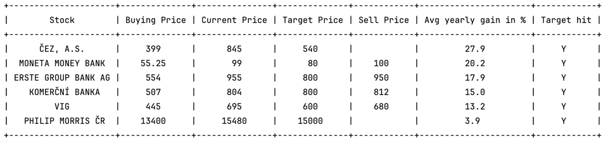

# Czech Stock Prices Notifier
The script sends notifications on Windows 10 and prints table view with information on chosen stocks 
traded at the Czech stock exchange RM-System.

The user should set up:
* what stocks to follow,
* the purchase price,
* the target price,
* whether to send notification for all the stocks or only those that hit the target price.

### Notification Example

As a table:

As Windows toast notification:

