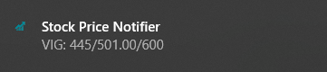

# Czech Stock Prices Notifier
The script sends notifications on Windows 10 on the stocks traded at the Czech stock exchange RM-System.

The user should set up:
* what stock to follow,
* what was her purchase price,
* what is the target price,
* whether to send notification for all the stocks or only those that hit the target price.

Script can then be run using the Windows Task Scheduler.

### Notification Example

